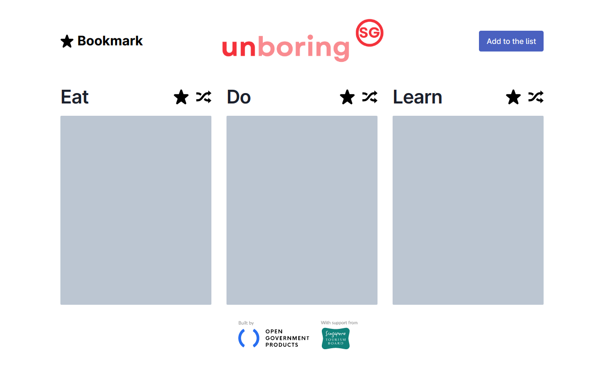

# unboring.sg

A convenient way of discovering new things all over Singapore in each new browser tab that you open. It's kind of like your favourite colleague telling you about that cool new thing they found last weekend!

## The Tech Stack

For the [website](https://github.com/thorwebdev/unboring.sg/tree/main/website) and [API layer](https://github.com/thorwebdev/unboring.sg/tree/main/website/pages/api) we used [Next.js](https://nextjs.org/) hosted on [Vercel](https://vercel.com/home), and for the backend data layer we used [Supabase](https://supabase.com/), probably the best stack for building MVPs quickly.

For the user interface we utilised [Open Government Products Design System](https://github.com/opengovsg/design-system), one of the other Hackathon projects, which uses Chakra UI under the hood.

The [Chrome extension](https://github.com/thorwebdev/unboring.sg/tree/main/chrome_extension) was built in VanillaJS and is using the website and APIs under the hood.

## Database schema

If you want to deploy this project yourself, you can find the SQL queries needed to set up your database tables in the [schema.sql file](./schema.sql).

## Credit

- [Kathleen Koh](https://www.linkedin.com/in/kathleenkohhuiying/) ([OGP](https://www.open.gov.sg/))
- [Sarah Espaldon](https://www.linkedin.com/in/sarahespaldon/) ([OGP](https://www.open.gov.sg/))
- [Shannen Ho](https://www.linkedin.com/in/shannen-ho/) ([OGP](https://www.open.gov.sg/))
- [Shanty Basrur](https://www.linkedin.com/in/sbasrur/) ([OGP](https://www.open.gov.sg/))
- [Thor Schaeff](https://twitter.com/thorwebdev) (co-hacker; Software Engineer at [Supabase](https://supabase.com))

### Special thanks

Special thanks to code contributors:

- [Antariksh Mahajan](https://github.com/mantariksh)
- [Ian Chen](https://github.com/pregnantboy)